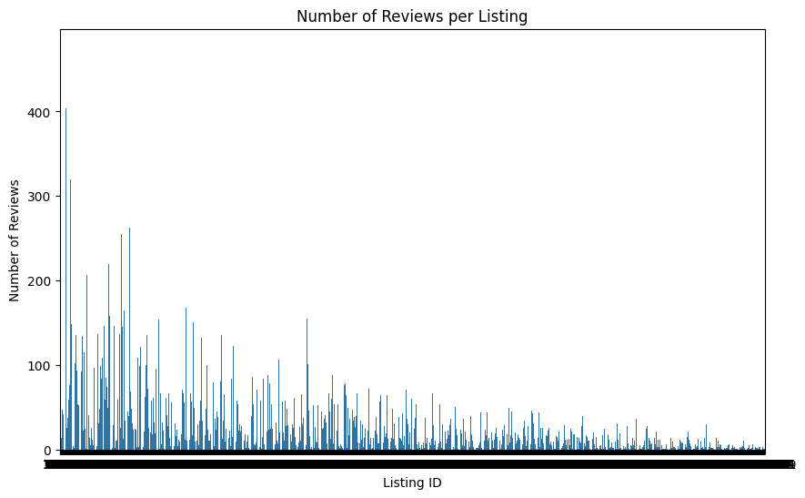
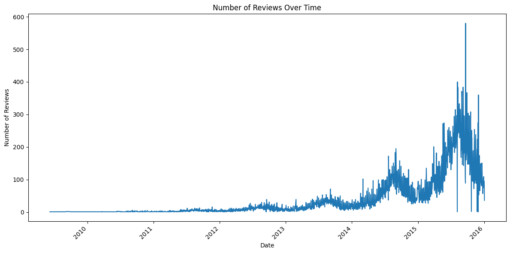
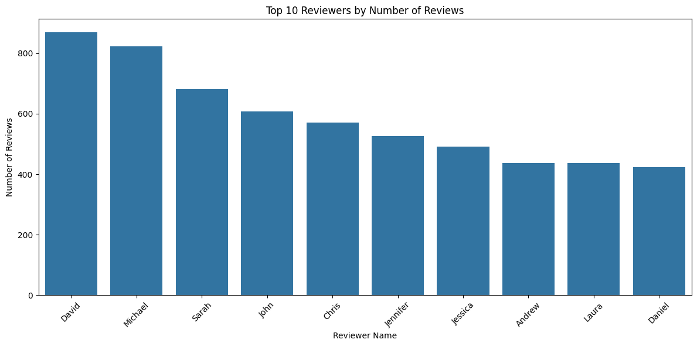
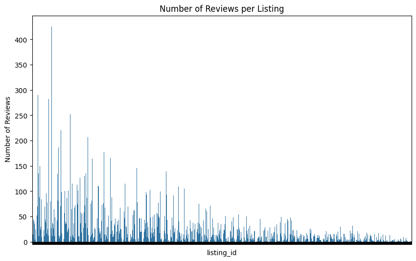
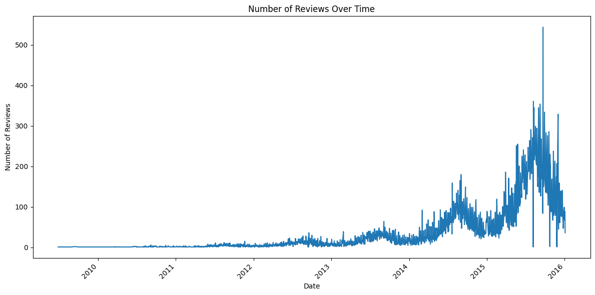

# Import


```python
# Import necessary libraries
import pandas as pd
import matplotlib.pyplot as plt
import seaborn as sns
from wordcloud import WordCloud

# Load the CSV file into a DataFrame
df = pd.read_csv('reviews.csv')
```


# Reviews per listing


```python
# Analysis 1: Number of reviews per listing
plt.figure(figsize=(10, 6))
review_counts = df['listing_id'].value_counts()
sns.barplot(x=review_counts.index, y=review_counts.values)
plt.title('Number of Reviews per Listing')
plt.xlabel('Listing ID')
plt.ylabel('Number of Reviews')
plt.show()
```


    

    


# Reviews over time


```python
# Analysis 2: Reviews over time
plt.figure(figsize=(12, 6))
df['date'] = pd.to_datetime(df['date'])
df['date'].value_counts().sort_index().plot(kind='line')
plt.title('Number of Reviews Over Time')
plt.xlabel('Date')
plt.ylabel('Number of Reviews')
plt.xticks(rotation=45)
plt.tight_layout()
plt.show()
```


    

    


# Top reviewers


```python
# Analysis 3: Top reviewers by number of reviews
plt.figure(figsize=(12, 6))
top_reviewers = df['reviewer_name'].value_counts().nlargest(10)
sns.barplot(x=top_reviewers.index, y=top_reviewers.values)
plt.title('Top 10 Reviewers by Number of Reviews')
plt.xlabel('Reviewer Name')
plt.ylabel('Number of Reviews')
plt.xticks(rotation=45)
plt.tight_layout()
plt.show()
```


    

    


# Distribution of review counts


```python
# Analysis 4: Distribution of review counts per listing
plt.figure(figsize=(10, 6))
sns.histplot(df['listing_id'].value_counts(), bins=10, kde=True)
plt.title('Distribution of Review Counts per Listing')
plt.xlabel('Number of Reviews')
plt.ylabel('Frequency')
plt.show()
```


    

    


# Wordcloud


```python
# Analysis 5: Word cloud of most common words in comments
plt.figure(figsize=(12, 8))
df['comments'] = df['comments'].fillna('').astype(str)
text = ' '.join(df['comments'])
wordcloud = WordCloud(width=800, height=400, background_color='white').generate(text)
plt.imshow(wordcloud, interpolation='bilinear')
plt.axis('off')
plt.title('Most Common Words in Comments')
plt.show()
```


    

    

